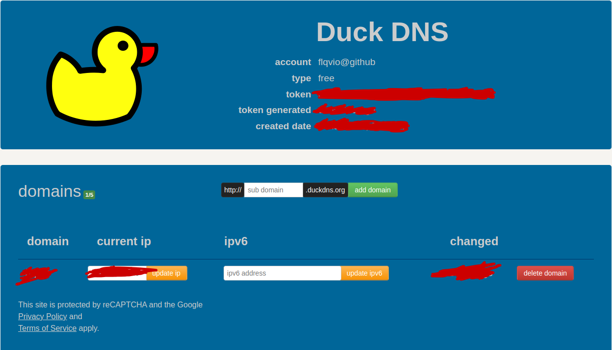

# FPOracle

**A little documentation to make a server multi-function with Oracle Free Tier.**

It contains :
- DuckDNS to have a free domain name (and subdomains)
- Portainer to manage and deploy stack and containers with Docker
- Nginx Proxy Manager to implement reverse proxy
- MCSManager to host and manage Minecraft servers on a web interface
- Jellyfin to host and manage a media server to watch your movies, series etc..
- Wireguard to host a VPN (for me, hosted in Marseille, France)

## Table of contents

- [FPOracle](#fporacle)
  - [Table of contents](#table-of-contents)
  - [Server creation on Oracle \& First config](#server-creation-on-oracle--first-config)
  - [Important part about firewall rules \& Oracle](#important-part-about-firewall-rules--oracle)
  - [Portainer](#portainer)
  - [DuckDNS](#duckdns)
  - [Nginx Proxy Manager](#nginx-proxy-manager)
  - [Wireguard VPN](#wireguard-vpn)
  - [MCSManager](#mcsmanager)
  - [Jellyfin](#jellyfin)

## Server creation on Oracle & First config 

All begins with an account creation on [Oracle Cloud Free Tier](https://www.oracle.com/fr/cloud/free/), with a real credit card (no money will be taken, it's just for verification). Lydia or  online bank is not allowed.

Then, you can create a new instance (in Compute tab) with the max configuration for free :
- ***Image*** : Canonical Ubuntu 22.04 Minimal aarch64
- ***Arm-based processor*** : Ampere A1 Compute (VM.Standard.A1.Flex)
- ***OCPU*** : 4 core equivalent 
- ***RAM*** : 24 GB
- ***Boot volume size*** : 200 GB

**DO NOT FORGET TO SAVE THE SSH PRIVATE KEY, YOU MUST IT TO CONNECT TO YOUR SERVER FOR THE FIRST TIME. If you forget it, you must redo all the procedure of instance creation.**

> If the following error appears : `Error: Out of capacity...` you must wait and retry the instance creation (this can take hours or days before Oracle re-allocate some un-used machines).
<br />Some scripts are available to check the availability of the machines. You can find them [here](https://github.com/hitrov/oci-arm-host-capacity). (not tested)

When the instance is created, you can connect to it with the public IP and the private key. You can find the public IP in the instance details.

```bash
ssh -i /path/to/private/key ubuntu@public_ip
```
ubuntu user has not password, to create it :
```bash
sudo passwd ubuntu
```
and to enable ssh connection with password :
```bash
sudo nano /etc/ssh/sshd_config
```
and change the line `PasswordAuthentication no` to `PasswordAuthentication yes`. Then, restart sshd service :
```bash
sudo systemctl restart sshd
```
You can even do a config file to connect to the server :
```bash
nano ~/.ssh/config
```
and adding the following lines :
```bash
Host oracle-server
    HostName 'your-public-ip'
    User ubuntu
```
To connect to the server without password and private key explicitly, you can copy your public key to the server :
```bash
ssk-keygen
ssh-copy-id oracle-server
```
Before beginning to install all the services, you must update and upgrade the server :
```bash
sudo apt update && sudo apt upgrade -y
```
Important part about firewall rules & Oracle 
---
There is 2 main part that you must know about Oracle compute instances :
- The firewall we will using is managed by Oracle on their website, so, in the future of this configuration, you must add rules in the Oracle console to allow ports (Networking >> Virtual cloud networks >> vcn-xxxxxxx-xxxx >> Security List Details).
- You must delete the IPTables rules to allow the firewall to be managed by Oracle :
```bash
sudo mv /etc/iptables/rules.v4 /etc/iptables/rules.v4.bak
```
and reboot your server.
Without this, the firewall will block all the ports, even if you allow them in the Oracle console.

| Service | TCP/UDP | Ports to open
| ----------- | ----------- | ----------- |
| SSH | TCP | 22 |
| DuckDNS & HTTP/HTTPS | TCP | 80, 443 |
| Portainer | TCP | 9443 |
| Minecraft Servers Ports | TCP | 25565 - ... |
| Wireguard VPN | UDP | 51820 |

For installations purposes, some ports (like 81 for Ngix Proxy Manager) must be open to the world, but after, you can remove them from the Oracle web interface and keep only the ports you need.
All ports must not be open to the world, cause to Nginx Proxy Manager, all the services will be accessible with the domain name and subdomains.

## Portainer

This part will present how to install Portainer to manage and deploy stack and containers with Docker.
First of all, you must install Docker, follow the official installation guide [here](https://docs.docker.com/engine/install/ubuntu/).
Then, you can install Portainer with the following command :
```bash
docker volume create portainer_data

docker run -d -p 8000:8000 -p 9443:9443 --name portainer --restart=always -v /var/run/docker.sock:/var/run/docker.sock -v portainer_data:/data portainer/portainer-ce:latest
```

You can get to these official documentation [here](https://docs.portainer.io/start/install-ce/server/docker/linux).

Now, you can go to the address `https://your-public-ip:9443` and create an admin account.

Your Portainer is now ready to use !

## DuckDNS

This part will present how to install DuckDNS to have a free domain name and subdomains.
First of all, go to [DuckDNS Website](https://www.duckdns.org/) and register.
Choose a domain name and add it. Take your public IP of your server and put it on "current ip" field and click on "update ip".

  

Take the token and go to Portainer, add a new stack, name it "duckdns", paste the following Docker Compose and deploy it :

- **Be careful to change subdomains you want, token field and volume that you want on your server.**

```yaml
---
version: "2.1"
services:
  duckdns:
    image: lscr.io/linuxserver/duckdns:latest
    container_name: duckdns
    network_mode: host #optional
    environment:
      - PUID=1000 #optional
      - PGID=1000 #optional
      - TZ=Etc/UTC #optional
      - SUBDOMAINS=add, any, subdomains, you, want
      - TOKEN=your-token
      - UPDATE_IP=ipv4 #optional
      - LOG_FILE=false #optional
    volumes:
      - /path/to/config:/config #optional
    restart: unless-stopped
```
Now, to use your domain name we will install Nginx Proxy Manager.

## Nginx Proxy Manager

This part will present how to install Nginx Proxy Manager to implement reverse proxy.

First of all, go to Portainer, add a new stack, name it "npm", paste the following Docker Compose and deploy it :

- **Be careful to change the volume that you want on your server.**

```yaml
version: '3.8'
services:
  app:
    image: 'jc21/nginx-proxy-manager:latest'
    restart: unless-stopped
    ports:
      - '80:80'
      - '81:81'
      - '443:443'
    volumes:
      - /path/to/data:/data
      - /path/to/letsencrypt:/etc/letsencrypt
```

To access to the web interface, you must open the port 81/TCP (see [Important part about firewall rules & Oracle](#important-part-about-firewall-rules--oracle)) on your server and go to `https://your-public-ip:81`.

The default credentials of Nginx Proxy Manager is :
- **Email** : `admin@example.com`
- **Password** : `changeme`

Create an account with a real email and change the password.

Now, you can add your subdomains in the DuckDNS stack (in `SUBDOMAINS` field with a comma between each other) and update the stack on Portainer before you can use them in Nginx Proxy Manager.

I advice you to change the response of the default site in settings to a 404 or 444 error.


>(For the example, `portainer.domain.duckdns.org` and `npm.domain.duckdns.org`), so in DuckDNS stack in Portainer, add `portainer, npm` in `SUBDOMAINS` field and update the stack.

Now we will create 2 subdomains :
1. Go to `Proxy Hosts` tab and click on `Add Proxy Host`.
2. In domain names field, put the subdomain you want to use (for example, `portainer.domain.duckdns.org` or `npm.domain.duckdns.org`). 
3. Choose `http` (Choose `https` ONLY FOR PORTAINER).
4. Go to your host and do `ip a` to get your local IP (`10.0.X.X`), go back on NPM and put it in `Forward Hostname/IP` field.
5. In `Forward Port` field, put the port of the service you want to use (for example, 9443 for Portainer, 81 for NPM).
6. Tick `Websockets Support`.
7. Go to SSL tab, choose `Request a new SSL Certificate with Let's Encrypt` and tick `Force SSL`.
8. Verify your mail and click on `Save`. 

Now you can go to `https://portainer.domain.duckdns.org` and `https://npm.domain.duckdns.org` to access to Portainer and Nginx Proxy Manager with HTTPS.

Not mandatory, but you can remove port 81/TCP from your server (see [Important part about firewall rules & Oracle](#important-part-about-firewall-rules--oracle)).
I advice to keep 9443/TCP for Portainer, cause, if a problem happen with the DNS or your host, you must access it with the public IP and the port.

And that's all for Nginx Proxy Manager !

## Wireguard VPN

This part will present how to install Wireguard to host a VPN (for me, hosted in Marseille, France).

Insure that you have open the port 51820/UDP (see [Important part about firewall rules & Oracle](#important-part-about-firewall-rules--oracle)).

First of all, before deploying the stack, you must create a dedicated volume for Wireguard : `sudo docker volume create wireguard_data`.
  
Then, go to Portainer, add a new stack, name it "wireguard", paste the following Docker Compose and deploy it :
```yaml
version: "3.3"
services:
  vpn:
    image: lscr.io/linuxserver/wireguard:latest
    container_name: wireguard
    cap_add:    
      - NET_ADMIN
    environment:
      - PUID=1000
      - PGID=1000
      - TZ=Etc/Paris
      - SERVERURL=auto
      - SERVERPORT=51820
      - PEERS=choose-a-name
      - PEERDNS=auto
      - INTERNAL_SUBNET=10.13.13.0
      - ALLOWEDIPS=0.0.0.0/0
      - PERSISTENTKEEPALIVE_PEERS=
      - LOG_CONFS=true
    volumes:
      - wireguard_data:/config
    ports:
      - 51820:51820/udp
    sysctls:
      - net.ipv4.conf.all.src_valid_mark=1
    restart: unless-stopped
volumes:
    wireguard_data:
        external: true
```

Then, get the file `/var/lib/docker/volumes/wireguard_data/_data/[peer_choose-a-name]/[peer_choose-a-name].conf`. This file contains all the informations to connect to the VPN.

On Ubuntu desktop, you can import a VPN with this file.

That's all for Wireguard !

## MCSManager

On this part we will see how to install MCSManager a minecraft server gestionnary.

Like the other service we have to go on portainer and clik on add a new stack, then put this (u can name it "mcs"):
```yaml
version: '3'
services:
  mcsmanager-daemon:
    image: node:20.9.0-bullseye
    working_dir: /opt/mcsmanager/daemon
    ports:
      - "24444:24444" 
      - "25565:25565" #default minecraft server port
      - "25566:25566" 
      - "25567:25567" #u can add more ports (as u want)
    volumes:
      - /path/to/mcsmanager-daemon:/opt/mcsmanager/daemon
    command: sh -c 'apt-get update && apt-get install -y openjdk-11-jdk openjdk-17-jre && git clone https://github.com/MCSManager/MCSManager-Daemon-Production.git /opt/mcsmanager/daemon && cd /opt/mcsmanager/daemon && npm install --production && node app.js'
    restart: always


  mcsmanager-web:
    image: node:20.9.0-bullseye
    working_dir: /opt/mcsmanager/web
    volumes:
      - /path/to/mcsmanager-web:/opt/mcsmanager/web
    ports:
      - "23333:23333"
    command: sh -c 'git clone https://github.com/MCSManager/MCSManager-Web-Production.git /opt/mcsmanager/web && cd /opt/mcsmanager/web && npm install --production && node app.js'
    restart: always
    depends_on:
      - mcsmanager-daemon

volumes:
  mcsmanager-daemon:
  mcsmanager-web:
```

The problem with this docker-compose is when you want to update somethings on the stack you have to start from scratch the configuration...😔

So when the stack you have to add the domain name:

Go to npm and create 2 subdomains :
1. Go to `Proxy Hosts` tab and click on `Add Proxy Host`.
2. In domain names field, put the subdomain you want to use (for example, `mcs.domain.duckdns.org` or `daemon.domain.duckdns.org`). 
3. Choose `http`.
4. Go to your host and do `ip a` to get your local IP (`10.0.X.X`), go back on NPM and put it in `Forward Hostname/IP` field.
5. In `Forward Port` field, put the port of the service you want to use ( 23333 for MCS-web, 24444 for the MCS-daemon).
6. Tick `Websockets Support`.
7. Go to SSL tab, choose `Request a new SSL Certificate with Let's Encrypt` and tick `Force SSL`.
8. Verify your mail and click on `Save`. 

> Don't forget to add the subdomain in the duckdns stack

Now go on mcs.domain.duckdns.org and create an admin account.

To create several instance of minecraft server we have to connect the MCS-daemon to the MCS-web

1. Go in the advanced settings and choose `Daemon`.
2. Click on `Add Daemon`
3. `Remark` (Optional): MCS-Daemon
4. `Public IP or Daemon`: wss://daemon.domain.duckdns.org
5. `Port of Daemon`: 443
6. `Verify Token`: For this part you have to go on the terminal and copy the **key** with this command:
```bash
cat /opt/mcsmanager/daemon/data/Config/global.json
```

If the connection is <span style="color:green">Online</span> that's work! 👍

Now you can create a minecraft server (java for example):
1. Go on `Application`.
2. Choose the right daemon.
3. Click on `New Instance`.
4. Choose `Minecraft Server: Java Edition`.
5. Choose `Upload single Server Core`
6. Put the `Instance name`: Test (for example)
7. Click on `Upload server Core`
8. Put a server.jar files you can found all the version on mcversions.net (for the example i take [server-1_20_2.jar](https://piston-data.mojang.com/v1/objects/5b868151bd02b41319f54c8d4061b8cae84e665c/server.jar))

The instance is created.

1. Now click on `Application`
2. Choose the `Test` instance
3. Click on `Start`
4. Now you have to accept the EULA on the `File management`
5. Edit Eula.txt and put **true** instead of **false** on **eula=**
6. Start again the server
7. Wait the creation of the world
8. When it's done you can connect on the server with the minecraft client (on the default port if you not change the server port)

> don't forget to open your port on Oracle 25665 for the default port and more if you need more server
🥵

## Jellyfin
